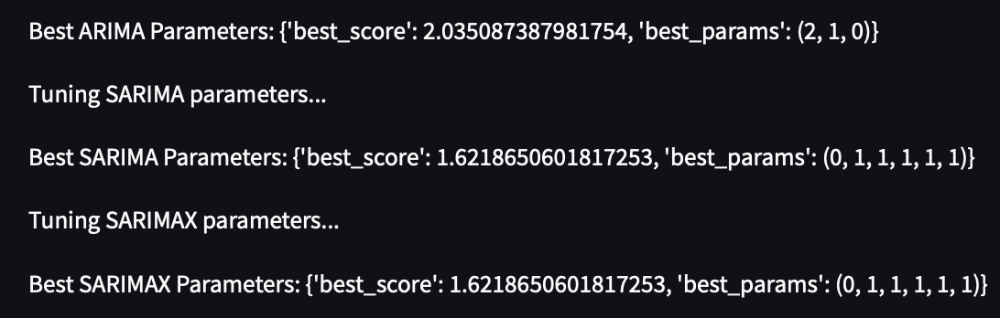

# **Time-Series Forecasting on Web Traffic**

This project focuses on time-series analysis and forecasting of Google’s web traffic data to predict the number of views for a Wikipedia web page.  

## **Tech Stack**
- **Cloud Services:** AWS S3  
- **Programming & Libraries:** Python, Boto3, pandas, os, Streamlit, Statsmodels  
- **DevOps & CI/CD:** GitHub Actions  

---

## **Project Overview**

### **1. Data Loading and Storage**
- Configured **AWS CLI** and created an **IAM User** with appropriate permissions.  
- Uploaded raw time-series data into an **S3 Bucket** for centralized storage.  

---

### **2. ETL Pipeline**
Developed a modular **ETL pipeline** with the following structure:  
1. **Extract:**  
   - Retrieved raw data from the S3 bucket.  
2. **Transform:**  
   - Processed and cleaned the data for analysis.  
   - Performed data transformations to prepare it for forecasting.  
3. **Load:**  
   - Saved the transformed data in a structured format into the local `data/processed` directory.  

---

### **3. Exploratory Data Analysis (EDA) and ETS Decomposition**
- Performed **ETS decomposition** to identify key components of the time series:  
  - **Trend:** Observed a consistent fluctuation over time.  
  - **Seasonality and Residuals:** Analyzed patterns to guide model selection.  
- Applied an **Additive ETS** model based on observed trends.

---

### **4. Model Training**
Implemented and compared three forecasting models:  
- **ARIMA** (Auto-Regressive Integrated Moving Average)  
- **SARIMA** (Seasonal ARIMA)  
- **SARIMAX** (Seasonal ARIMA with Exogenous Variables)  

---

### **5. Hyperparameter Tuning**
- Conducted extensive hyperparameter tuning to optimize model performance.  
- Selected the best parameters for each model.  
  

---

### **6. Model Serialization**
- Saved the best-performing models as **pickle files** for future deployment.  

---

### **7. Deployment with Streamlit**
- Built a **Streamlit app** to deploy the trained model, enabling interactive forecasting.

---

### **8. CI/CD Pipeline Integration**
- Integrated **GitHub Actions** to automate:  
  - Testing  
  - Deployment  
- Addressed challenges in dependency management (e.g., GitHub misinterpreting Python 3.10 as 3.1 😅).  

---

### **9. GitHub Integration**
- Hosted the entire project on GitHub for version control and collaboration.  
- **DVC Pipeline:** Although the dataset was relatively small, plans were outlined to incorporate **DVC** for data versioning in projects with larger datasets.  

---

## **Diagram**
The lifecycle of the project is illustrated below:  
  
