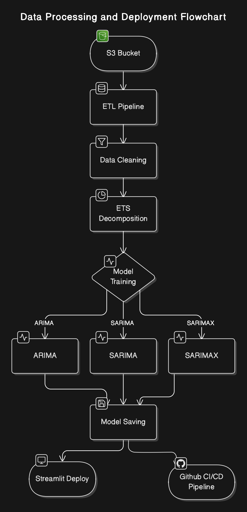

# Time-Series-Forcasting-on-Web-Traffic 

Performed time-series analysis and forecasting on Google's web traffic dataset to forecast number of views of Wikipedia web page

Tech-Stack:
     AWS S3 , Python , Boto3 , pandas , os , Streamlit , Statsmodel , CI-CD Pipeline
    

## Project Description

